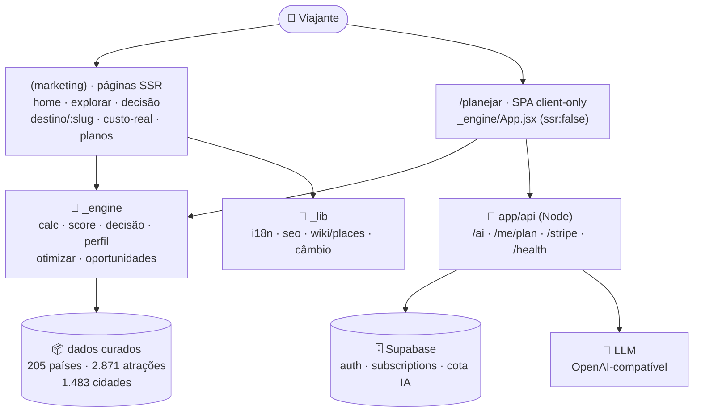

<div align="center">


# Mundo Sem Fim

### O copiloto que **decide a viagem com você** — não a que vende a reserva.

Cruze **estação climática × janela de visto × fôlego de dinheiro** numa timeline longa
e descubra a **ordem dos países que não te quebra**.

<br/>

[](https://mundo-sem-fim.vercel.app)

[](https://nextjs.org/)
[](https://react.dev/)
[](https://tailwindcss.com/)
[](https://supabase.com/)
[](https://stripe.com/)
[](https://vitest.dev/)
[](#seo-pwa-e-performance)
[](#internacionalização)

</div>

> **Não somos uma OTA. Somos a camada de decisão antes dela.**
> As OTAs te empurram opções. A gente diz **pra onde ir** pelo seu perfil, **quanto custa de verdade**
> (não só voo + hotel) e monta **o roteiro que recalcula**. Conselho neutro — porque a gente não vende a reserva.

<div align="center">

**[Os números](#os-números)** · **[O motor de decisão](#como-funciona-o-motor-de-decisão)** · **[Features](#por-dentro-do-produto)** · **[Rodar localmente](#rodando-localmente)** · **[Deploy](#deploy)** · **[Arquitetura](#arquitetura)**

</div>

---

## Índice

- [O que é](#o-que-é)
- [O que nenhum app de viagem faz](#o-que-nenhum-app-de-viagem-faz)
- [A tríade do produto](#a-tríade-do-produto)
- [Os números](#os-números)
- [Por dentro do produto](#por-dentro-do-produto)
- [Como funciona o motor de decisão](#como-funciona-o-motor-de-decisão)
- [Arquitetura](#arquitetura)
- [Stack](#stack)
- [Rodando localmente](#rodando-localmente)
- [Variáveis de ambiente](#variáveis-de-ambiente)
- [Testes](#testes)
- [Deploy](#deploy)
- [Internacionalização](#internacionalização)
- [SEO, PWA e performance](#seo-pwa-e-performance)
- [Estrutura de pastas](#estrutura-de-pastas)
- [Status do produto](#status-do-produto)
- [Princípios](#princípios)
- [Licença](#licença)

---

## O que é

**Mundo Sem Fim** é a **camada de inteligência de decisão de viagem** — um copiloto neutro que vive *acima* das OTAs.

Os outros apps respondem *"quanto custa a passagem?"*. A gente responde:

> **"Essa viagem inteira faz sentido pra mim — e cabe no meu bolso?"**

O problema do viajante não é falta de opção. É **excesso de opção sem contexto**. E a maioria das viagens
**não dá errado no destino — dá errado na decisão, antes de comprar a passagem**: você chega na monção,
fura o visto, ou a grana acaba no meio do caminho.

Mundo Sem Fim transforma **dados** (custo real, regras de visto, estação climática, índices de perfil) em uma
**leitura acionável**: pra onde ir, em que ordem, quanto custa de verdade — e quando é melhor **esperar**.

---

## O que nenhum app de viagem faz

A diferença não é cosmética — é de **posição na cadeia de decisão**. Todo mundo te ajuda a *comprar*.
Ninguém te ajuda a *decidir*.

| App | O que ele faz | Conflito de interesse |
| :-- | :-- | :-- |
| Booking | Vende hospedagem | Quer que você reserve |
| Airbnb | Vende estadia | Quer que você reserve |
| Expedia | Vende pacote | Quer que você compre |
| Google Flights | Mostra o voo | Otimiza o clique |
| Skyscanner / Hopper | Acha a passagem barata | Comissão por reserva |
| **🌍 Mundo Sem Fim** | **Decide *antes* da compra** | **Nenhum — não vende a reserva** |

> *"Quando achamos que não vale comprar agora, a gente fala — uma OTA jamais diria isso."*

---

## A tríade do produto

O ângulo proprietário, o que apps de férias curtas **não conseguem** fazer: decidir a **ORDEM dos países**
numa timeline longa. Errar a ordem custa caro.

<div align="center">

### 🌦️ Estação  ×  🛂 Visto  ×  💸 Fôlego  =  **a ordem certa**

</div>

- **🌦️ Estação** — chegar em cada país na melhor janela climática (e fugir da monção / do pico de preço).
- **🛂 Visto** — respeitar a janela de permanência por nacionalidade, sem risco de furo / deportação.
- **💸 Fôlego (runway)** — garantir que a grana atravessa a viagem inteira, trecho a trecho — não só o início.

> *"Estação × visto × fôlego: a ordem dos países muda tudo. O plano recalcula clima, visto e grana quando você mexe."*

---

## Os números

O verdadeiro moat: um catálogo de dados de viagem **curado e enriquecido por deep-research multiagente** —
não scraping genérico.

| Métrica | Valor |
| :-- | --: |
| 🌍 Países no catálogo | **205** |
| 🎟️ Atrações com preço de entrada (USD) | **2.871** |
| 🏙️ Cidades enriquecidas (dicas, passes, grátis, especialidades) | **1.483** |
| 🚐 Preços de transporte por país | **1.640** itens · 205 países |
| 🍜 Pratos típicos catalogados | **1.472** itens · 167 países |
| 🗺️ Pontos "fora da rota" (anti-óbvio) | **1.043** |
| 📊 Índice de perfil por país | **205 × 7** dimensões |
| 💱 Moedas suportadas | **145+** |
| 🗣️ Idiomas | **4** (pt · en · es · ja) |

Cada um dos 205 países tem a página `/destino/:slug` (8 pré-renderizadas + ISR de 1 dia) com **veredito editorial,
Mundo Score, ficha técnica com selo de frescor, custo de referência, atlas com atrações/cidades geolocalizadas,
passeios com preço de referência e "vale ir agora?"**.

> **Honestidade dos números:** preços de atrações, transporte e custo diário são **pesquisa de referência (jun/2026)**,
> exibidos com o selo **HISTÓRICO**. Câmbio é a **taxa de referência do dia** (open.er-api / BCE), com data — não a
> taxa do cartão. Detalhes em `/fontes` e `docs/PRICE-FRESHNESS-SLA.md`.

---

## Por dentro do produto

37 componentes de produto sobre um motor de funções puras. Tudo organizado por **o valor que entrega**:

<details open>
<summary><b>🧭 Decisão honesta</b> — diz pra onde ir, e pra quem NÃO serve</summary>

- **Veredito humano** (`VerdictCard`) — conselho de amigo por país: *"Cilada ou oportunidade?"* + listas prescritivas **"Eu iria se…"** / **"Eu evitaria se…"**.
- **Mundo Score** (`TravelFitScore`) — *"Vale a pena para você?"* em 0–100, com 6 subnotas (custo real, segurança, experiência, facilidade, cansaço logístico, custo emocional) e **chance de arrependimento**.
- **Vale ir agora?** (`ValeIrAgora`) — cruza destino × mês atual e pode te mandar **esperar o próximo ciclo** (o oposto da OTA).
- **Motor de decisão** (`decisao.js`) — ranqueia destinos pelo seu perfil e **explica o porquê** (as 2 dimensões mais fortes + 1 alerta).

</details>

<details>
<summary><b>💸 Custo de verdade</b> — o preço de vitrine mente</summary>

- **O que a vitrine esconde** (`CustoVitrineVsReal`) — preço anunciado (voo+hotel) ~~riscado~~ vs **custo real da viagem inteira**, item a item. *"Sem taxa escondida, porque a gente não vende a reserva."*
- **Custo real em 3 níveis** (`custoTotal.js` + `CustoTiers`) — vida diária + transporte + seguro + eSIM + vistos + contingência 12%, nos tiers **mochila 0,7× / médio 1,0× / conforto 1,9×**.
- **Modo grupo** (`ModoGrupo` / `split.js`) — divide o custo **antes** de viajar (não depois, como o Splitwise).
- **Central de Oportunidades** (`oportunidades.js`) — varre o plano e lista ganhos priorizados P0–P2: furo de visto, orçamento estourado (com onde cortar), trecho fora de época, modo mochila (~30% de economia).

</details>

<details>
<summary><b>🎟️ O que fazer (com preço real)</b></summary>

- **Passeios & ingressos** (`PasseiosIngressos`) — atrações reais do país com **preço de entrada USD→BRL ao vivo**, chips por categoria e link pro Google Maps.
- **O que ninguém te conta** (`OQueNinguemConta`) — dicas curadas que não saem em blog: golpes (tuk-tuk 3×, ATM de aeroporto), câmbio paralelo, lotação real.
- **Como se locomove** (`ComoSeLocomove`) — preços reais de Uber/Grab, táxi, metrô, ônibus e aluguel **por país**.

</details>

<details>
<summary><b>🗺️ Logística & ordem</b> — resolve por você, sem caixa-preta</summary>

- **Otimizador de ordem** (`otimizar.js`) — busca local 2-opt **determinística** que reordena os trechos pela melhor estação e menor zigue-zague. Sem IA, auditável.
- **Score de voos** (`FlightScoreCard`) — *"o voo mais barato não é o melhor voo"*: Preço(35) + Duração(20) + Escalas(15) + Horário de chegada(20) + Bagagem(10), penalizando chegada de madrugada e voo que **domina o orçamento**.
- **Exportar** (`exportar.js`) — gera `.ics` (RFC 5545) pro calendário + rota no **Google Maps** com waypoints.
- **Cenários A/B + Checklist** — compare Rota A vs B e gere preparativos derivados da rota.

</details>

<details>
<summary><b>🙋 Pessoal & inteligente</b></summary>

- **Super-perfil** (`perfil.js`) — vetor de **9 interesses** (0–1), **13 presets** (mochileiro, luxo, romântico, família…) que **aprende ao favoritar destinos**.
- **Favoritos · Busca global · Multimoeda (145+) · 4 idiomas** com switch acessível por teclado.

</details>

<details>
<summary><b>💼 Negócio</b> — monetização alinhada ao viajante</summary>

- **Freemium** (`planos.js` / `Gate`) — 3 planos **free / premium / pro**; trava real no servidor, gate de UX no client.
- **Stripe** — checkout + webhook via REST (sem SDK), HMAC verificado à mão.
- **Afiliados honestos** — Wise, eSIM, seguro-viagem com `rel="sponsored"` e aviso de comissão. *"A assinatura se paga no primeiro corte de orçamento que a gente sugere."*

</details>

---

## Como funciona o motor de decisão

O coração do produto é um **pipeline de funções puras** (testáveis, sem React, sem rede). Onde os concorrentes
*listam*, aqui o sistema *decide* — e explica.

```mermaid
flowchart LR
    P["🙋 Super-perfil<br/>9 interesses (0–1)<br/>13 presets"] --> CALC
    CALC["⚙️ calc.js<br/>estação × visto × fôlego<br/>+ câmbio multimoeda"] --> SCORE
    SCORE["📊 score.js<br/>8 dimensões 0–100<br/>+ nota geral + selo"] --> DEC
    DEC["🧭 decisao.js<br/>ranqueia + explica<br/>o porquê"] --> OUT["✅ Veredito<br/>ir · esperar · evitar"]
    FAV["❤️ Favoritos"] -. aprende (taxa 0.15) .-> P
    OPT["🗺️ otimizar.js<br/>2-opt determinístico"] --> CALC
```

- **`calc.js`** — recalcula tudo: datas de chegada por trecho, custos convertidos à moeda base, fôlego trecho-a-trecho, status de estação/visto e conflitos.
- **`score.js`** — converte o `calc` em **8 dimensões** (custo-benefício, conforto, segurança, tempo livre, experiência local, gastronomia, risco, economia) + nota geral ponderada + **selo** (excelente / bom / regular / fraco).
- **`decisao.js`** — ranqueia opções pelos pesos do perfil e escolhe as 2 dimensões mais fortes + 1 alerta para gerar a explicação.
- **`perfil.js`** — o super-perfil que vira pesos e **aprende** a cada destino favoritado.

> Quase todo módulo do `_engine` tem um `.test.js` gêmeo. **A lógica de decisão é determinística e auditável.**

---

## Arquitetura

Next.js 14 (App Router, **JSX puro — sem TypeScript**) com separação rígida de camadas dentro de `app/`.



| Pasta | Responsabilidade |
| :-- | :-- |
| `app/(marketing)` | Páginas SSR de produto (home, explorar, decisão, comparar, `destino/[slug]`, voos, custo-real, planos…) |
| `app/planejar` | O **planner** — SPA client-only, carregada via `dynamic(..., { ssr: false })` |
| `app/_engine` | **Motor de decisão**: lógica pura de cálculo/score/decisão + dados do motor + componentes do planner |
| `app/_lib` | Utilidades e integrações: catálogo, i18n, SEO, Wikipedia/Wikidata/Places, câmbio, analytics |
| `app/_components` | 37 componentes de UI de produto |
| `app/_ui` | Design system (Button, Modal, Tabs, Badge, EmptyState, ThemeToggle) |
| `app/api` | 5 rotas Node: `/ai`, `/health`, `/me/plan`, `/stripe/checkout`, `/stripe/webhook` |

**Persistência:** `localStorage` por padrão (chaves `mundosemfim.*`); sync opcional no Supabase quando o usuário entra.
Plano compartilhável via hash (`#r=`) — sem nunca expor chave de IA.

---

## Stack

| Camada | Tecnologia |
| :-- | :-- |
| Framework | **Next.js 16** (App Router, JSX; contratos de domínio com JSDoc + `tsc --checkJs`) |
| UI | **React 19** + **Tailwind CSS 3** + tokens MERIDIANO (RGB, dark mode) — ver `docs/BRAND-RATIONALE.md` |
| Tipografia | Bricolage Grotesque + Geist + Geist Mono (`next/font/google`) |
| Auth & dados | **Supabase** (Postgres + RLS) |
| Pagamentos | **Stripe** (REST, sem SDK; webhook HMAC manual) |
| IA | LLM **OpenAI-compatível** server-side (Groq/OpenRouter via `AI_BASE_URL`), com cota diária |
| Câmbio | `open.er-api.com` (taxa de referência diária) + Frankfurter/BCE para despesas — rotulado RECENTE com data |
| Mapas e rotas | MapLibre + OpenFreeMap (OSM) · OSRM/FOSSGIS · coordenadas Wikipedia/Wikidata |
| Clima | Open-Meteo (gratuito só p/ uso não comercial) |
| Testes | **Vitest** — 39 suítes / 277 testes · RLS em Postgres real (Docker) · QA tela a tela + E2E (Playwright) |
| Analytics | GTM + PostHog (opcionais, *no-op* seguro) |
| PWA | Service worker + manifest + shell offline |
| Deploy | **Vercel** (recomendado) + **Render** (Blueprint) |

---

## Rodando localmente

> **Pré-requisito:** Node **≥ 20.9** (exigência do Next 16; os deploys fixam Node 20).

```bash
# 1. instalar dependências
npm install

# 2. configurar ambiente (o app roda 100% mesmo sem nenhuma chave)
cp .env.example .env.local   # no Windows/PowerShell: Copy-Item .env.example .env.local

# 3. subir em desenvolvimento
npm run dev                  # http://localhost:3000
```

| Script | O que faz |
| :-- | :-- |
| `npm run dev` | Servidor de desenvolvimento (`next dev`) |
| `npm run build` | Build de produção (`next build`) |
| `npm start` | Servir o build (`next start`) |
| `npm test` | Suíte de testes (`vitest run`) |
| `npm run lint` / `npm run typecheck` | ESLint 9 · `tsc` do domínio |
| `npm run verify` | lint + typecheck + testes |
| `npm run test:rls` | RLS real em Postgres (Docker) — 34 casos |
| `npm run qa -- <url>` | QA tela a tela (19 rotas × 7 larguras × claro/escuro) |

> 💡 **Degradação graciosa:** sem nenhuma variável de ambiente, IA, login, Stripe, afiliados e analytics viram
> *no-op* seguro — o app abre e funciona. As chaves só **destravam** recursos; nada quebra sem elas.

---

## Variáveis de ambiente

Copie `.env.example` para `.env.local` (git-ignored) e preencha **só o que quiser ligar**. Nada é estritamente obrigatório.

| Grupo | Variáveis | Sem isso… |
| :-- | :-- | :-- |
| **Núcleo (recomendado)** | `NEXT_PUBLIC_SUPABASE_URL`, `NEXT_PUBLIC_SUPABASE_ANON_KEY` | Login e sync na nuvem desligados (usa só `localStorage`) |
| **IA** | `OPENAI_API_KEY` · `AI_BASE_URL` · `AI_MODEL` (def. `gpt-4o-mini`) · `AI_DAILY_LIMIT` (def. 50) | Otimizador IA / oportunidades IA desligados (otimizador determinístico continua) |
| **Stripe** | `STRIPE_SECRET_KEY` · `STRIPE_WEBHOOK_SECRET` · `STRIPE_PRICE_PREMIUM` · `STRIPE_PRICE_PRO` · `SUPABASE_SERVICE_ROLE_KEY` | App roda 100% no plano grátis |
| **Maps** | `NEXT_PUBLIC_GOOGLE_MAPS_JS_KEY` · `GOOGLE_PLACES_API_KEY` | Mapas/Places degradam |
| **Afiliados** | 8× `NEXT_PUBLIC_AFF_*` (Travelpayouts, Viator, GYG, Klook, Civitatis, Wise, SafetyWing, Booking) | Deep-links abrem sem a tag |
| **Analytics** | `NEXT_PUBLIC_GTM_ID` · `NEXT_PUBLIC_POSTHOG_KEY` · `NEXT_PUBLIC_POSTHOG_HOST` · `NEXT_PUBLIC_ANALYTICS` | `track()` vira no-op |
| **SEO** | `NEXT_PUBLIC_SITE_URL` | Canonical/OG caem no domínio de produção da Vercel |

> 🔐 **Segurança:** o que tem `NEXT_PUBLIC_` é público por design (protegido por RLS no Supabase).
> `SUPABASE_SERVICE_ROLE_KEY`, `STRIPE_SECRET_KEY` e `OPENAI_API_KEY` são **segredos de servidor** — nunca com `NEXT_PUBLIC_`.

---

## Testes

```bash
npm test          # vitest run (execução única, sem watch)
```

**44 suítes Vitest (313 testes)** cobrindo domínio, motor e bibliotecas, mais RLS real (`npm run test:rls`, 76 casos), E2E da jornada (`scripts/e2e-viagem.mjs`), E2E da plataforma (`scripts/e2e-plataforma.mjs`), acessibilidade (`scripts/a11y.mjs`) e QA visual (`scripts/qa-telas.mjs`):

- **`app/_engine` (25 suítes)** — score, custo total, orçamento, rateio de grupo, câmbio, roteiro, otimizar, decisão, cenários, oportunidades, afiliados, previsão de voo, perfil, checklist, dicas, exportar, share, storage…
- **`app/_lib` (8 suítes)** — flights, security (CSP/headers), wiki/wikiClient/wikiThumb, editorial, seo, destinos-prioritários.

> A disciplina de **funções puras** no `_engine` é o que torna o motor de decisão testável e confiável.

---

## Deploy

Cada `push` na branch **`main`** dispara deploy automático.

### ▲ Vercel — recomendado

Zero-config (Next.js auto-detectado), rotas de API serverless, sem hibernação.

[](https://vercel.com/new/clone?repository-url=https://github.com/felipemenezes25000-spec/teste-mkt)

### 🟣 Render — Blueprint 1-clique

Lê o `render.yaml` (Web Service único servindo UI + API, `healthCheckPath` `/api/health`, Node 20).
O plano free hiberna após inatividade (~30s pra acordar).

[](https://render.com/deploy?repo=https://github.com/felipemenezes25000-spec/teste-mkt)

**Pós-deploy (se usar login):** no Supabase → *Authentication → URL Configuration*, adicione a URL pública em
*Site URL* e *Redirect URLs* — senão o magic link não volta certo em produção.

---

## Internacionalização

i18n **caseiro** (`app/_lib/i18n.js`), sem framework, com **4 idiomas**:

🇧🇷 `pt` (padrão / SSR) · 🇬🇧 `en` · 🇪🇸 `es` · 🇯🇵 `ja`

- Hook `useIdioma()` com `t()` e fallback triplo (idioma → `pt` → a própria chave).
- Persistência em `localStorage` + cookie `msf.lang.v1`, com `CustomEvent('msf:lang')` pra sincronizar a UI.
- Telas de produto e plataforma nos 4 idiomas (dicionários `i18nTelas.js`/`i18nPlataforma.js`, paridade testada); conteúdo editorial longo segue em pt-BR.
- `MoedaPicker` acessível com **146 moedas** (27 base + 119 extra), busca por código/nome.

---

## SEO, PWA e performance

Estratégia **sem assets estáticos** — tudo gerado em runtime:

- **SEO** — sitemap dinâmico (214 URLs: 9 core + 205 destinos) via função pura testada; `robots.js` bloqueia `/api`, `/conta`, `/salvos`; canonical por página.
- **JSON-LD rico** — `Organization`, `WebSite` (+ `SearchAction`), `TouristDestination` (+ `GeoCoordinates`), `BreadcrumbList`, `FAQPage` e `Product` (+ `Offer` em BRL). `AggregateRating` **só** aparece com depoimentos reais.
- **OG/Twitter images dinâmicas** — `next/og` em edge runtime (1200×630), sem PNG estático.
- **PWA** — `manifest.js` standalone (theme `#0E5A4E`), service worker `network-first` com fallback offline + `stale-while-revalidate`, ícones 192/512 (any + maskable) gerados em runtime.
- **Performance** — ISR (`revalidate: 86400`), `generateStaticParams` nos 8 destaques, `next/font` com `display: swap`, anti-flash de tema inline antes do paint, hero com `fetchPriority="high"` + LQIP.
- **A11y** — `prefers-reduced-motion`, focus ring, `sr-only`, contraste WCAG 1.4.3, `@media print` pra PDF.
- **Headers** — CSP completa, `X-Frame-Options: DENY`, `Referrer-Policy`, `Permissions-Policy`, HSTS na Vercel.

---

## Estrutura de pastas

```
mundo-sem-fim-app/
├─ app/
│  ├─ (marketing)/          # páginas SSR de produto (home, decisão, destino/[slug]…)
│  ├─ planejar/             # planner SPA (client-only, ssr:false)
│  ├─ offline/              # shell PWA do service worker
│  ├─ api/                  # ai · health · me/plan · stripe/checkout · stripe/webhook
│  ├─ _engine/              # 🧠 motor de decisão (puro, testado) + dados do motor
│  ├─ _lib/                 # 🧰 dados, i18n, SEO, integrações, câmbio, analytics
│  ├─ _components/          # 37 componentes de produto
│  ├─ _ui/                  # design system
│  ├─ layout.jsx · manifest.js · sitemap.js · robots.js
│  └─ opengraph-image.jsx · twitter-image.jsx
├─ docs/                    # specs + setup (analytics, stripe, plataforma)
├─ public/                  # sw.js + estáticos
├─ supabase/                # migrações SQL (init, ai_usage, subscriptions)
├─ next.config.mjs · tailwind.config.js · vitest.config.js · render.yaml
└─ .env.example
```

---

## Status do produto

**Produção:** https://mundo-sem-fim-lac.vercel.app (Vercel, projeto `mundo-sem-fim`) com Supabase `mundo-sem-fim` (São Paulo).
**Plataforma:** B2B/white-label (`/agencias`), API pública (`/desenvolvedores`, `/api/v1`), marketplace (`/marketplace`) e checkout de produtos próprios — ver [`docs/PLATAFORMA.md`](docs/PLATAFORMA.md).

Execução do prompt **OMEGA V4** (2026-10-09): status real por lote em [`docs/OMEGA-V4-STATUS.md`](docs/OMEGA-V4-STATUS.md),
retomada em [`docs/CONTINUATION.md`](docs/CONTINUATION.md), provedores em [`docs/PROVIDER-MATRIX.md`](docs/PROVIDER-MATRIX.md).
Integrações que dependem de chave/contrato (voos, hotéis, experiências, Stripe, Supabase, IA) estão prontas no
código e marcadas como `BLOCKED_EXTERNAL`/`ADAPTER_READY` — nada é exibido como “ao vivo” sem ser.

---

## Princípios

O que torna este produto diferente não é só o código — é a postura:

- 🤝 **Conselho neutro** — não vendemos a reserva, então podemos te mandar **esperar**.
- 🧾 **Custo honesto** — vitrine vs. real, sem taxa escondida.
- ✋ **Prova social honesta** — `DEPOIMENTOS = []` até existirem depoimentos **reais** com permissão. Zero números fabricados.
- 🛟 **Resiliência** — roda 100% sem nenhuma variável de ambiente (tudo degrada com *no-op* seguro).
- 🧪 **Lógica testável** — motor de funções puras + 33 suítes Vitest.

---

## Licença

Produto comercial — **© 2026 Felipe. Todos os direitos reservados.**
Código-fonte proprietário; não licenciado para redistribuição sem autorização.

<div align="center">
<br/>

**[🌍 mundo-sem-fim.vercel.app](https://mundo-sem-fim.vercel.app)**

*Decida a viagem da sua vida — com um copiloto que pensa por você.*

</div>
